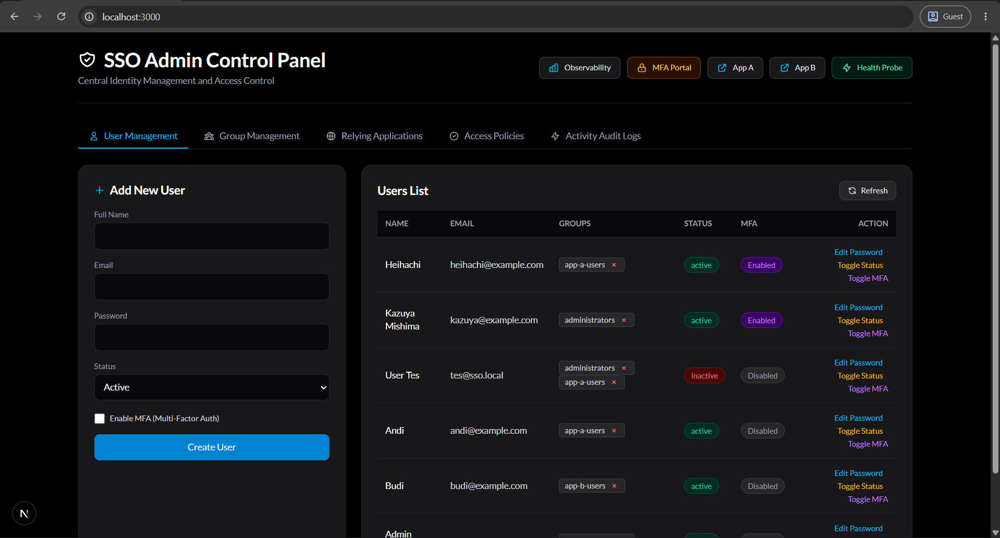
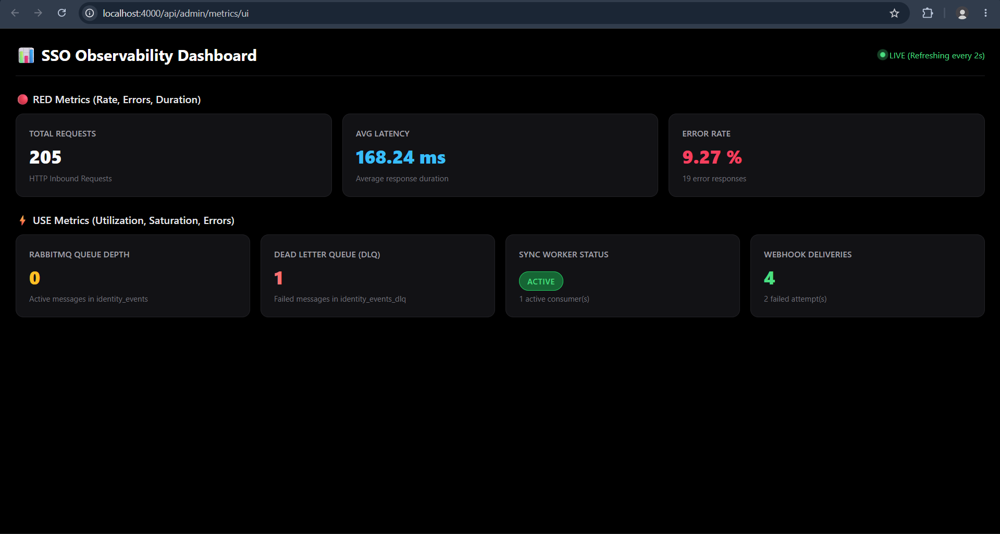
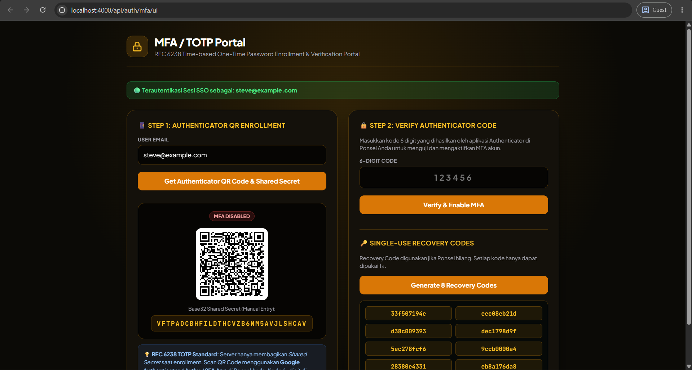
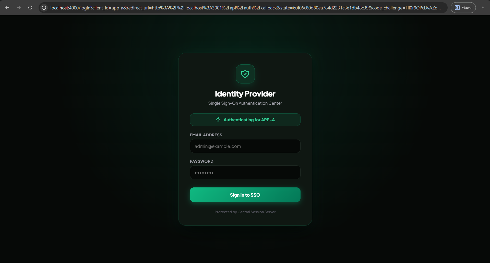
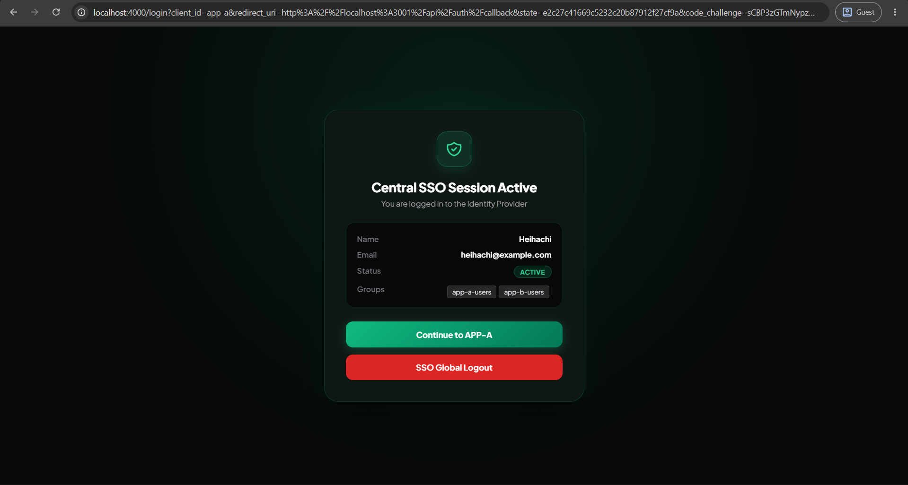
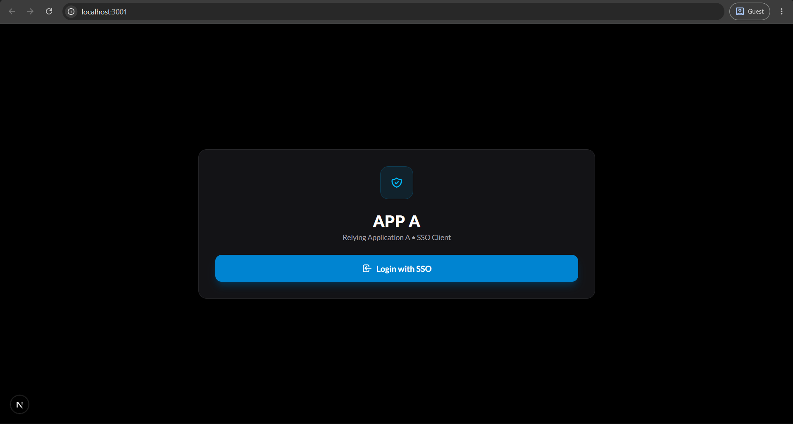
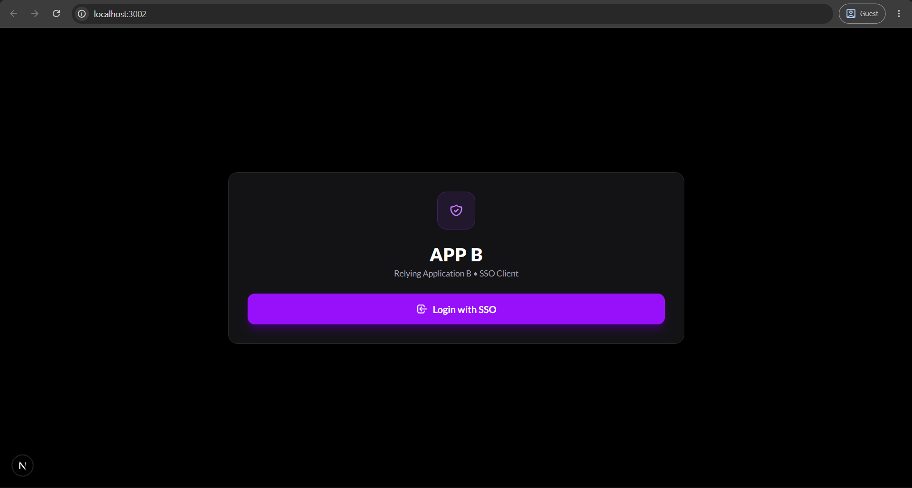
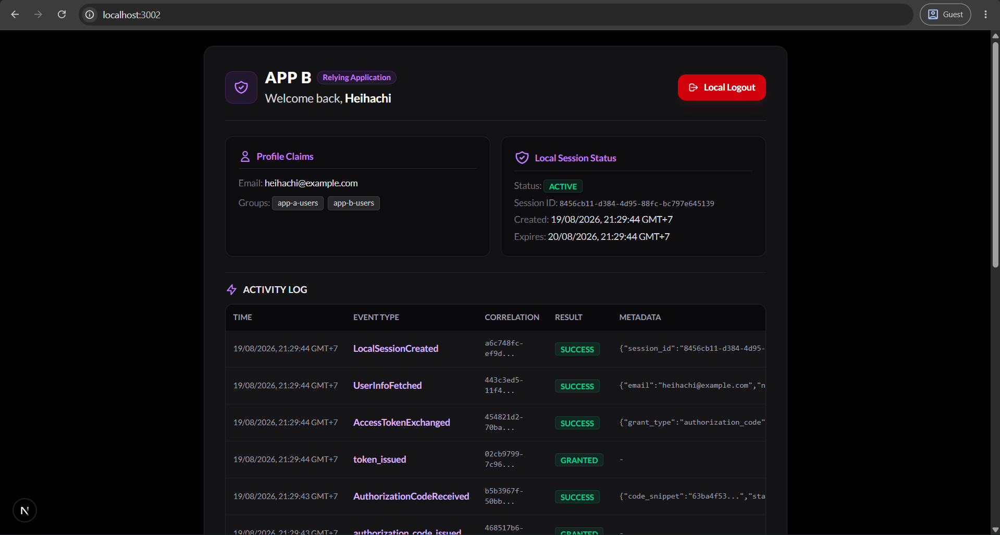

# 🛡️ Distributed Identity & Authorization Provider (SSO System)

Sistem Identity dan Authorization Provider terdistribusi berbasis **OAuth 2.0 / OpenID Connect** dengan dukungan **Single Sign-On (SSO)**, **Transactional Outbox Event Synchronization**, **Multi-Factor Authentication (MFA/TOTP)**, **Real-Time Observability Dashboard (RED/USE Metrics)**, serta **Graceful Shutdown & Health Probes**.

---

## 👤 Identitas Pengembang
* **Nama:** Kevin Wirya Valerian
* **NIM:** 13524019

---

## 🚀 Cara Menjalankan Sistem

Seluruh infrastruktur (Auth Provider, Database PostgreSQL, RabbitMQ Message Broker, Outbox Publisher, Sync Worker, Control Panel Admin, App A, dan App B) dapat dijalankan menggunakan **Docker Compose**.

### 1. Prasyarat
* Docker Desktop & Docker Compose v2
* Node.js v22 (opsional, untuk eksekusi lokal tanpa Docker)

### 2. Menjalankan Seluruh Kontainer
Buka terminal pada direktori utama repositori ini, lalu jalankan:

```bash
docker compose up --build -d
```

### 3. Eksekusi Migrasi Database & Seeding Data
Setelah seluruh kontainer siap dan *healthy*, jalankan perintah seeding data (User awal `admin@sso.local` / `admin123` dan konfigurasi Client Applications):

```bash
# dari direktori auth-provider:
cd auth-provider
npx prisma db push
npx prisma db seed
```

---

## 🌐 Daftar URL Komponen

| Komponen | URL / Port | Keterangan |
| :--- | :--- | :--- |
| **Control Panel Admin (Next.js)** | `http://localhost:3000` | Admin Management Portal (Terproteksi Otorisasi SSO Grup `administrators`) |
| **Auth Provider Server API** | `http://localhost:4000` | Core SSO API & Authorization Server |
| **App A (Relying Application 1)** | `http://localhost:3001` | Client Web Application A |
| **App B (Relying Application 2)** | `http://localhost:3002` | Client Web Application B |
| **RabbitMQ Management Dashboard** | `http://localhost:15672` | UI Monitoring Broker (`guest` / `guest`) |
| **PostgreSQL Database** | `localhost:5432` | DB Utama (`admin` / `secret`, DB: `sso_db`) |
| **MFA (TOTP) Portal** | `http://localhost:4000/api/auth/mfa-ui` | Halaman Setup & Testing 2FA TOTP |
| **Observability Dashboard** | `http://localhost:4000/metrics-ui` | Dashboard Monitoring Real-Time (Dark Mode) |
| **Health Probe - Liveness** | `http://localhost:4000/health/live` | Health Check Event Loop Process |
| **Health Probe - Readiness** | `http://localhost:4000/health/ready` | Health Check Ketersediaan DB & Broker |

---

## 🏗️ Arsitektur & Alur Kerja Sistem

Sistem ini terdiri dari 7 microservice utama yang terintegrasi secara asinkron:

```
                  +-----------------------------------+
                  |          Browser / Client         |
                  +-----------------+-----------------+
                                    |
          +-------------------------+-------------------------+
          | (OAuth2 Auth Code)      | (MFA & Session)         | (Admin Management)
          v                         v                         v
  +---------------+        +-----------------+        +---------------+
  |   App A Web   |        |  Auth Provider  |        | Control Panel |
  | (Port 3001)   |        |   (Port 4000)   |        | (Port 3000)   |
  +---------------+        +--------+--------+        +---------------+
                                    |
                                    | (Transactional Outbox)
                                    v
                           +-----------------+
                           | PostgreSQL DB   |
                           +--------+--------+
                                    |
                                    v
                           +-----------------+
                           | Outbox Publisher|
                           +--------+--------+
                                    |
                                    v
                           +-----------------+
                           | RabbitMQ Broker |
                           +--------+--------+
                                    |
                                    v
                           +-----------------+
                           |   Sync Worker   |
                           +-----------------+
```

### 📂 Struktur Server Backend Modular (`auth-provider/server/src`):
```
src/
├── config/             # Sentralisasi Environment Constants (env.ts)
├── middlewares/        # Express Middlewares (metricsMiddleware.ts, errorHandler.ts)
├── services/           # Business Logic & Audit Trail (auditService.ts)
├── types/              # Centralized TypeScript Interfaces (index.ts)
├── routes/             # REST Route Controllers (auth, login, users, groups, apps, mfa, metrics)
├── utils/              # Cryptography & Revocation Engine (hash, totp, policyRevocation)
├── publisher.ts        # Outbox Relay Service
├── worker.ts           # RabbitMQ Sync Webhook Consumer
└── index.ts            # Entry Point Server Bootstrap
```

### Alur Utama (Workflow):
1. **Central Authentication & MFA Challenge**: User melakukan login di Auth Provider. Jika MFA aktif, server memberikan status `mfa_required` dan meminta 6-digit kode TOTP / Recovery Code sebelum cookie `sso_session` diterbitkan.
2. **OAuth 2.0 Authorization Code Exchange**: Aplikasi Klien mengarahkan user ke `/api/auth/authorize`. Setelah verifikasi, Auth Provider menerbitkan `authorization_code`. Klien menukar kode ini menjadi `access_token` melalui server-to-server request (`POST /api/auth/token`).
3. **Central Revocation & Outbox Relay**: Saat user me-logout atau admin mengubah password / status user di Admin Control Panel, status `SsoSession` diubah menjadi `revoked`. Event `PasswordChanged` / `SessionRevoked` dimasukkan ke tabel `events` secara atomik.
4. **Asynchronous Event Sync**: Service `outbox-publisher` membaca event pending di DB lalu mengarahkan ke RabbitMQ Queue (`identity_events`). `sync-worker` mengonsumsi event tersebut dan mengosongkan sesi lokal di App A dan App B via Webhook.

---

## 💡 Keputusan Teknis (Technical Decisions)

### 1. Pilihan Token: Opaque Token vs JWT
* **Keputusan**: Menggunakan **Opaque Token** (Random Cryptographic String 256-bit ter-hash SHA-256 di database).
* **Alasan & Konsekuensi**:
  * *Kelebihan*: Memungkinkan **instant revocation**. Ketika user melakukan logout pusat, password diubah, atau admin mencabut sesi, sesi langsung tidak valid di detik yang sama.
  * *Konsekuensi*: Setiap verifikasi token memerlukan query lookup ke database PostgreSQL. Diatasi dengan pemanfaatan index database pada `token_hash` untuk performa lookup cepat ($O(1)$).

### 2. Pilihan Message Broker: RabbitMQ vs Redis Pub/Sub
* **Keputusan**: Menggunakan **RabbitMQ** (AMQP Broker).
* **Alasan**:
  * Memiliki mekanisme **message persistence dan durability** sehingga pesan tidak akan hilang jika broker restart.
  * Mendukung **Dead Letter Queue (DLQ)** dan **Acknowledgment (ACK/NACK)** untuk menangani kegagalan pengiriman webhook ke aplikasi klien dengan retry backoff yang andal.

### 3. Mekanisme Autentikasi Service-to-Service (`/internal/logout`)
* **Keputusan**: Menggunakan **HMAC SHA-256 Signature Header** dan API Key internal.
* **Alasan**: Memastikan request pembatalan sesi lokal yang dikirim dari Sync Worker ke App A/App B terbukti otentik berasal dari Auth Provider resmi dan terlindungi dari manipulasi man-in-the-middle.

### 4. Soft Delete vs Hard Delete
* **Keputusan**: Menggunakan **Soft Delete** (`SessionStatus.revoked` dan timestamp `revoked_at`).
* **Alasan**:
  * Menjaga integritas data *historical audit logs* untuk kebutuhan audit keamanan (*Security Compliance & Fraud Detection*).
  * Mencegah timbulnya orphan records pada tabel terikat seperti `access_tokens` dan `authorization_codes`.

---

## 🛠️ Technology Stack & Versi

* **Runtime & Language**: Node.js `v22.x` (Alpine) & TypeScript `v5.7.2`
* **Web Framework (Backend API)**: Express.js `v5.2.1`
* **Frontend Framework (Relying Apps & Control Panel)**: Next.js `v15.1.0` / Next.js `v16.2.12` (React 19)
* **Database & ORM**: PostgreSQL `v16`, Prisma ORM `v7.9.1`, `pg` `v8.23.0`
* **Message Broker & Queue**: RabbitMQ `v3-management-alpine`, `amqplib` `v2.0.1`
* **Containerization**: Docker & Docker Compose v2

---

## 📜 Daftar Endpoint API

| Method | Path | Deskripsi | Auth Required |
| :--- | :--- | :--- | :--- |
| `POST` | `/api/auth/login` | Login Email + Password (Return `mfa_required` jika 2FA aktif) | Tidak |
| `POST` | `/api/auth/login/mfa` | Verifikasi Kode 6-digit TOTP / Recovery Code | `mfa_token` |
| `GET` | `/api/auth/me` | Mengambil profil user yang sedang login | SSO Cookie |
| `GET` | `/api/auth/authorize` | OAuth 2.0 Authorization Endpoint | SSO Cookie |
| `POST` | `/api/auth/token` | OAuth 2.0 Token Exchange Endpoint | Client App |
| `GET` | `/api/auth/userinfo` | OIDC UserInfo Endpoint | Bearer Token |
| `ALL` | `/api/auth/logout` | Central SSO Logout (Trigger Outbox Revocation) | SSO Cookie |
| `PUT` | `/api/admin/users/:id` | Edit User Details & Change Password (Hard Revocation) | SSO Cookie + Grup `administrators` |
| `GET` | `/api/admin/me` | Check Admin Session & Group Membership | SSO Cookie + Grup `administrators` |
| `GET` | `/api/admin/audit-logs` | Fetch Activity Security Audit Logs (Paginated UI) | SSO Cookie + Grup `administrators` |
| `POST` | `/api/auth/mfa/setup` | Generate TOTP Base32 Secret & Recovery Codes | SSO Cookie |
| `POST` | `/api/auth/mfa/enable` | Konfirmasi & Aktifkan MFA akun | SSO Cookie |
| `POST` | `/api/auth/mfa/disable` | Nonaktifkan MFA akun | SSO Cookie |
| `GET` | `/api/admin/metrics` | API Data Metrik Observability (RED & USE) | Publik / Admin |
| `GET` | `/metrics-ui` | Web Dashboard Observability Real-Time | Publik |
| `GET` | `/health/live` | Liveness Probe Endpoint | Publik |
| `GET` | `/health/ready` | Readiness Probe Endpoint (DB & RabbitMQ Check) | Publik |

---

## 🌟 Fitur Bonus yang Dikerjakan

### 1. Bonus B01: Multi-Factor Authentication (MFA / TOTP)
* Implementasi algoritma **RFC 6238 TOTP** murni (Google Authenticator / Authy) tanpa dependensi pihak ketiga.
* Generasi 8 **One-Time Recovery Codes** ter-hash SHA-256.
* Penanganan *short-lived pending session* (5 menit) pada alur login 2-step.
* Pencatatan audit trail lengkap (`mfa_enrolled`, `mfa_success`, `mfa_failed`, `mfa_disabled`).

### 2. Bonus B02: Real-Time Observability Dashboard
* Pelacakan metrik **RED** (Request Rate, Error Rate 4xx/5xx, Average Latency dalam ms). Filter otomatis memisahkan polling internal dari metrik pengguna.
* Pelacakan metrik **USE** (RabbitMQ Queue Depth, Dead Letter Queue Count, Sync Worker Active Status).
* Dashboard UI modern dengan auto-refresh setiap 2 detik.

### 3. Bonus B03: Health Probes (Liveness & Readiness)
* Endpoint `/health/live` untuk memeriksa responsivitas Node.js event loop.
* Endpoint `/health/ready` yang menguji konektivitas riil ke database PostgreSQL dan RabbitMQ broker (mengembalikan HTTP `503 Service Unavailable` jika dependensi *down*).

### 4. Bonus B04: Graceful Shutdown System
* Penanganan sinyal OS (`SIGTERM` / `SIGINT`).
* Penghentian penerimaan request HTTP baru secara teratur (`server.close()`).
* Penyelesaian request *in-flight*, penutupan koneksi Prisma Client PostgreSQL pool, dan pemutusan koneksi RabbitMQ Channel/Connection secara bersih tanpa kebocoran data.

---

## 📸 Tangkapan Layar & Dokumentasi Sistem

Berikut adalah tangkapan layar antarmuka sistem yang telah diimplementasikan:

### 1. 🎛️ Control Panel Admin
*URL: `http://localhost:3000`*


### 2. 📊 Real-Time Observability Dashboard
*URL: `http://localhost:4000/metrics-ui`*


### 3. 🔐 Multi-Factor Authentication (MFA / TOTP) Portal
*URL: `http://localhost:4000/api/auth/mfa-ui`*


### 4. 🔑 Central Session & Login SSO Flow
* **Halaman Login Central SSO**:


* **Halaman Verification**:


### 5. 🌐 Relying Party App A
*URL: `http://localhost:3001`*

* **App A - Halaman Belum Login**:


* **App A - Halaman Setelah Login**:


### 6. 🌐 Relying Party App B
*URL: `http://localhost:3002`*

* **App B - Halaman Belum Login**:


* **App B - Halaman Terautentikasi**:


---

*Dibuat untuk memenuhi Tugas Seleksi 2 Labpro 2026.*

